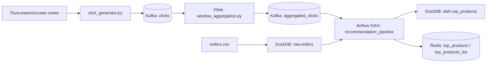

# Data Platform Workshop — прототип рекомендательного пайплайна  
**Kafka → Flink → Airflow → DuckDB → Redis**

## О проекте

Этот проект представляет собой прототип информационно-аналитической системы для расчёта популярности товаров и формирования итоговой витрины рекомендаций.

Пайплайн объединяет **потоковую обработку пользовательских кликов** и **пакетные данные о заказах**, после чего рассчитывает итоговый рейтинг товаров и сохраняет его:
- в **DuckDB** как локальную аналитическую витрину;
- в **Redis** как слой быстрого доступа для веб-приложения.

Проект выполнен как учебная реализация data platform и включает основные компоненты современной архитектуры:
- потоковую обработку данных;
- оркестрацию задач;
- аналитическое хранилище;
- feature store / serving layer;
- CI и инфраструктурные файлы.

## Что делает проект

Проект автоматизирует расчёт **top-10 популярных товаров** на основе двух источников данных.

### 1. Поток кликов пользователей
- клики генерируются и публикуются в Kafka topic `clicks`;
- далее они агрегируются по `product_id` в 5-минутных окнах;
- результат агрегации записывается в Kafka topic `aggregated_clicks`.

### 2. История заказов
- данные о заказах хранятся в файле `orders.csv`;
- в задаче Airflow они читаются через DuckDB;
- на их основе рассчитывается число заказов и выручка по каждому товару.

После этого Airflow:
- считывает последние агрегаты кликов;
- объединяет их с историей заказов;
- рассчитывает итоговый `score`;
- отбирает **top-10 товаров**;
- сохраняет итоговую витрину в **DuckDB** и **Redis**.

## Что является результатом работы

Результатом работы пайплайна являются:

### 1. Витрина в DuckDB
Таблица:

```sql
dwh.top_products
```

Она содержит итоговый рейтинг товаров, рассчитанный после объединения кликов и заказов.

### 2. Данные в Redis
Ключи:
- `top_products`
- `top_products_list`

Они используются как быстрый доступ к витрине для внешнего приложения.

## Архитектура пайплайна



## Как работает пайплайн по шагам

### Шаг 1. Генерация событий
Скрипт `click_generator.py` создаёт поток пользовательских кликов и отправляет их в Kafka topic `clicks`.

### Шаг 2. Потоковая агрегация
Скрипт `flink_job/window_aggregation.py` обрабатывает сообщения из `clicks`, группирует их по `product_id` и считает число кликов в каждом 5-минутном окне.

Результат записывается в topic `aggregated_clicks`.

### Шаг 3. Оркестрация в Airflow
DAG `recommendation_pipeline` запускается каждые 10 минут и выполняет 4 задачи:
- `read_kafka` — чтение последнего окна агрегатов из Kafka;
- `join_orders` — объединение агрегатов с заказами из DuckDB;
- `write_duckdb` — запись итоговой витрины в `dwh.top_products`;
- `write_redis` — запись результата в Redis.

### Шаг 4. Формирование рейтинга
Для каждого товара рассчитывается итоговый `score`.

По умолчанию используется формула:

```text
score = 0.7 * click_count + 0.3 * total_orders
```

После этого товары сортируются по убыванию score, и выбирается **top-10**.

## Основные технологии

### Apache Kafka
Используется для передачи событий:
- `clicks` — поток кликов;
- `aggregated_clicks` — результат оконной агрегации.

### Apache Flink
Используется для потоковой обработки и оконной агрегации кликов.

### Apache Airflow
Используется для оркестрации пакетной части пайплайна:
- чтение агрегатов;
- join с заказами;
- расчёт top-10;
- публикация результата.

### DuckDB
Используется как локальное аналитическое хранилище:
- загрузка заказов из `orders.csv`;
- хранение итоговой витрины `dwh.top_products`.

### Redis
Используется как слой быстрого доступа к результатам.

## Структура проекта

```text
data-platform-workshop/
├── airflow/
│   └── dags/
│       └── recommendation_dag.py
├── dbt/
│   ├── dbt_project.yml
│   └── models/
├── domains/
│   └── clickstream/
│       └── data_product.md
├── flink_job/
│   ├── window_aggregation.py
│   └── jars/
├── sql/
│   └── bigquery_ddl.sql
├── terraform/
│   ├── main.tf
│   ├── variables.tf
│   └── README.md
├── tools/
│   └── python_window_aggregation_fallback.py
├── .github/
│   └── workflows/
│       └── ci.yml
├── click_generator.py
├── docker-compose.yml
├── orders.csv
└── README.md
```

## Быстрый запуск

### 1. Поднять инфраструктуру

```bash
docker compose up -d
```

### 2. Создать Kafka topics

```bash
docker exec -it dpw-kafka bash -lc "kafka-topics --bootstrap-server kafka:29092 --create --if-not-exists --topic clicks --partitions 1 --replication-factor 1"
docker exec -it dpw-kafka bash -lc "kafka-topics --bootstrap-server kafka:29092 --create --if-not-exists --topic aggregated_clicks --partitions 1 --replication-factor 1"
```

### 3. Запустить генератор кликов

```bash
python click_generator.py --bootstrap-servers localhost:9092 --rate 5
```

### 4. Запустить агрегацию

#### Вариант A — через Flink

```bash
docker exec -it dpw-flink-jobmanager bash -lc "flink run -py /opt/flink/usrlib/window_aggregation.py"
```

#### Вариант B — fallback без Flink

```bash
python tools/python_window_aggregation_fallback.py --bootstrap-servers localhost:9092
```

### 5. Открыть Airflow
- URL: `http://localhost:8080`
- логин: `admin`
- пароль: `admin`

Активировать DAG:

```text
recommendation_pipeline
```

## Как проверить результат

### Проверка витрины в DuckDB

```sql
SELECT * FROM dwh.top_products ORDER BY updated_at DESC LIMIT 10;
```

### Проверка Redis

```bash
docker exec -it dpw-redis redis-cli HGETALL top_products
docker exec -it dpw-redis redis-cli GET top_products_list
```

## Что реализовано в проекте

В проекте реализованы:
- потоковая генерация событий;
- потоковая оконная агрегация;
- оркестрация DAG в Airflow;
- аналитическая витрина в DuckDB;
- быстрый доступ к данным через Redis;
- описание доменного data product;
- CI workflow на GitHub Actions;
- Terraform-файлы инфраструктуры.

## Особенности текущей реализации

Изначальный шаблон лабораторной работы предполагал использование BigQuery, однако в данной реализации вместо него используется **DuckDB** как локальное аналитическое хранилище.

Поэтому:
- исторические заказы читаются из `orders.csv`;
- итоговая витрина сохраняется в `dwh.top_products` в DuckDB;
- Redis используется как serving layer.

Файлы, связанные с BigQuery и dbt, сохранены в проекте как элементы исходной структуры задания, но основной рабочий сценарий выполняется через **DuckDB + Redis**.

## CI

В проекте подготовлен workflow GitHub Actions:

```text
.github/workflows/ci.yml
```

Он используется для автоматизированной проверки:
- Python-файлов;
- Terraform-конфигурации.

## Terraform

В каталоге `terraform/` размещены файлы инфраструктуры как кода:
- `main.tf`
- `variables.tf`

## Назначение проекта

Проект демонстрирует, как можно объединить:
- потоковые данные;
- пакетные данные;
- оркестрацию;
- аналитическую витрину;
- быстрый доступ к результатам

в едином пайплайне для расчёта популярности товаров и формирования рекомендаций.

## Автор

Матвей Райко

## Лицензия

Учебный проект.
