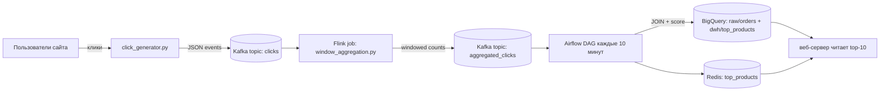

# Data Platform Workshop — прототип пайплайна рекомендаций (Kafka → Flink → Airflow → BigQuery + Redis)

Этот репозиторий — готовый **прототип** по заданию из *«Семинар №1»*: поток кликов в Kafka, оконная агрегация за 5 минут, обогащение историей заказов из BigQuery, запись витрины в BigQuery и в Redis, + IaC/CI скелет.

## Архитектура



## Что делает пайплайн

1) `click_generator.py` генерирует клики и пишет в Kafka topic `clicks`.  
2) `flink_job/window_aggregation.py` считает **кол-во кликов по каждому `product_id`** в **tumbling window 5 минут** и публикует результат в `aggregated_clicks` вместе с `window_start`/`window_end`.  
3) `airflow/dags/recommendation_dag.py` каждые 10 минут:
   - читает последние агрегаты из `aggregated_clicks`,
   - джойнится к историческим заказам в BigQuery,
   - считает скор (по умолчанию `score = 0.7*clicks + 0.3*orders`),
   - пишет топ-10 в BigQuery (`dwh.top_products`) и в Redis (hash `top_products`).

## Быстрый старт (локально)

### 1) Поднять инфраструктуру

```bash
cd data-platform-workshop
docker compose up -d
```

### 2) Создать Kafka topics

```bash
docker exec -it dpw-kafka bash -lc "kafka-topics --bootstrap-server kafka:29092 --create --if-not-exists --topic clicks --partitions 1 --replication-factor 1"
docker exec -it dpw-kafka bash -lc "kafka-topics --bootstrap-server kafka:29092 --create --if-not-exists --topic aggregated_clicks --partitions 1 --replication-factor 1"
```

### 3) Запустить генератор кликов (на хосте)

```bash
python -m venv .venv && source .venv/bin/activate
pip install -r requirements.txt
python click_generator.py --bootstrap-servers localhost:9092 --rate 5
```

### 4) Запустить агрегацию

**Вариант A (предпочтительно): Flink / PyFlink**  
1) Скачайте Kafka connector JAR (см. `flink_job/README.md`) и положите в `flink_job/jars/`.  
2) Затем:

```bash
docker exec -it dpw-flink-jobmanager bash -lc "flink run -py /opt/flink/usrlib/window_aggregation.py"
```

**Вариант B (fallback без Flink): простой Python consumer/producer**  
```bash
python tools/python_window_aggregation_fallback.py --bootstrap-servers localhost:9092
```

### 5) Airflow

UI: `http://localhost:8080` (логин/пароль: `admin/admin`).

## BigQuery

- Создайте dataset'ы `raw` и `dwh` (Terraform: `terraform/`).
- Создайте таблицы (DDL: `sql/bigquery_ddl.sql`).

---

MIT (учебный пример).
